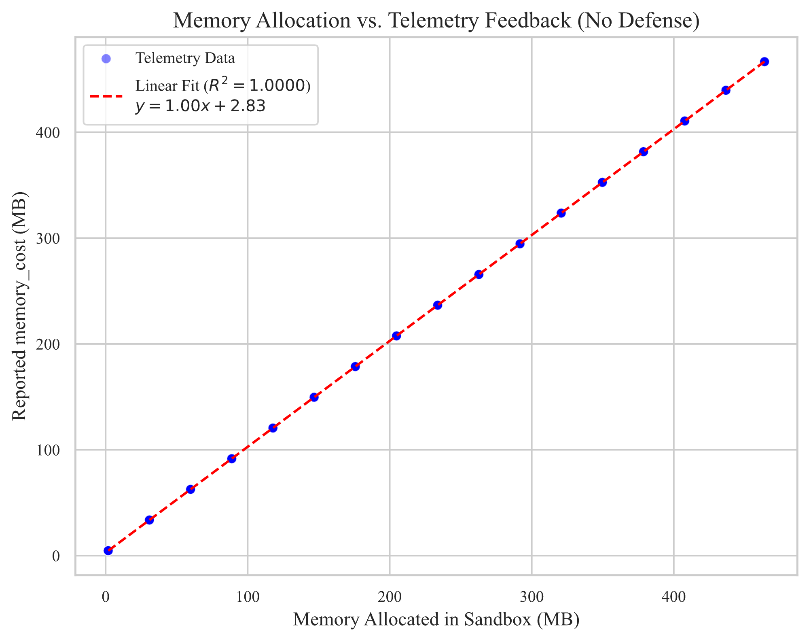

## 背景

我最近使用線上程式評測系統（Online Judge）時，發現：「不公開測資」理論上能讓答題者無法瀏覽測資，但繳交程式碼後，執行狀態、執行時間、記憶體用量等遙測數據，是否可以作為獲取測資的隱蔽通道？

## 驗證

### 建立隱蔽通道

先選擇最適合作為隱蔽通道的遙測數據：

| 遙測數據   | 可用狀態                                     | 穩定性   |
| ---------- | -------------------------------------------- | -------- |
| 執行狀態   | ~10 種（WA, RE, TLE 等）                     | 佳       |
| 執行時間   | ~2000 種（0 ms ~ 2000 ms，最小刻度為 1 ms）  | 容易波動 |
| 記憶體用量 | ~4000 種（1 MB ~ 500 MB，最小刻度為 128 KB） | 佳       |

我選擇狀態多且穩定的「記憶體用量」作為隱蔽通道。

繳交程式碼到 Online Judge，觀察記憶體用量：

```c++
#include <vector>

int main() {
	int data = 16;
	std::vector<char>((size_t)data * 1024 * 1024);
}
```



_圖 1：沙盒記憶體配置與遙測數據回傳對照圖_

實驗確認到記憶體用量可在 2.8 MB ~ 489.2 MB 區間內準確操控。

確認通道具備可控性後，我將欲傳遞的數值 $val \in [-1, 255]$（包含 1 Byte 字元資料與預留狀態 $-1$）線性映射為記憶體配置大小：

$$\text{Memory}(val) = (val + 1) \times 1.9\text{ MB}$$

- 當 $val = -1$ 時，配置 $0\text{ MB}$。
- 當 $val = 255$ 時，配置約 $486.4\text{ MB}$。

此設計將 257 種離散狀態均勻分佈於 $2.8\text{ MB} \sim 489.2\text{ MB}$ 的可控區間內，相鄰數值間具備約 $1.9\text{ MB}$ 的安全間隔，以抵抗沙盒雜訊。

### 直覺做法

我首先嘗試了直覺想法：

- 繳交多次程式碼到 Online Judge，每次透過 $\text{Memory}()$ 洩漏一個字元，直到 EOF。
- 把洩漏的字元全部串起來，就是完整測資。

實驗發現：洩漏出的結果很奇怪，似乎是每次 $\text{Memory}()$ 洩漏的字元會取自不固定的測資，最終導致這個做法失敗。

我們需要規劃一套能夠處理多筆測資的做法。

### 評測環境特性與觀測模型

在進入資料洩漏演算法前，需先確立 Online Judge 在多筆測資下的遙測機制與限制：

1. 每筆測資獨立執行，記憶體用量不會跨測資累計。
2. 僅回傳所有測資中的「最大記憶體用量」，而非個別測資的數據：
   $$M_{\text{OJ}} = \max_{i \in \text{TestCases}} \big( \text{Memory}(TestCase_i) \big)$$

由於可觀測的 $M_{\text{OJ}}$ 反饋被 $\max$ 運算高度壓縮，因此需設計專門的演算法，分離不同測資的反饋，逐筆洩漏出來。

### 洩漏演算法

我首先專注在「取得一筆完整的測資」。

為確保洩漏的字元來自同一筆測資，在洩漏第 $i$ 個字時，我先比對測資的第 $0$ 到 $i-1$ 字，確保與當前已取得的內容完全相同，然後才呼叫 $\text{Memory()}$ 。

效果：能穩定取得一筆完整的測資，且是字典序最大的測資（ $\max$ 運算所致）。

#### 洩漏演算法：多筆測資

單筆測資的成功，證實了只要鎖定前綴，就能藉由 $\max$ 運算沿著字典序最大的路徑走到底。

抽象來說：所有未知的測資，在結構上共同組成了一棵隱式前綴樹。

```
		  [ Root ]
		 /        \
       'a'        'c'
	   /          / \
	 'i'        'a' 'u'
	 /          /     \
   'r'        't'     'p'
   /          /         \
[EOF]	   [EOF]	   [EOF]
```

_圖 2：隱式前綴樹遍歷與回溯示意圖_

資料洩漏的過程，本質上就是在黑箱環境中遍歷這棵前綴樹。

由於 $\max$ 運算的特性，遍歷過程會優先選擇「最右側」分支（即 ASCII 碼最大者），一路向下探索至葉節點（EOF），完成第一筆（字典序最大）測資的重建。

關鍵問題：當一條路徑走到盡頭後，在完全無法預知樹狀結構的前提下，該如何探測隱藏的分歧點位置，並完成回溯以探索其他較小的分支？

##### 基於共同前綴長度的即時回溯

我沒有採用逐層向根節點遞減探測的做法，而是再次利用評測系統的 $\max$ 機制來定位分歧點。

當取得一筆完整測資後，讓所有尚未完全探索的測資在沙盒內計算與已知測資的共同前綴長度，並將該長度直接傳入 $\text{Memory}()$：

$$L = \max_{i} \big( \text{LCP}(TestCase_i, Known) \big)$$

透過單次提交，評測系統回傳的記憶體最大值會直接對應到最長共同前綴長度。演算法藉此在單次查詢內精準跳轉至最深分歧點深度 $k = L$，免去逐層盲搜的開銷。

##### 條件抑制與分支轉向

鎖定分歧點深度 $k$ 後，需要迫使 $\max$ 運算轉向較小的未探索分支。做法是將已探索的字元作為上限進行抑制：

| **索引範圍** | **判定條件**              | **沙盒行為**                                          | **目的**                     |
| ------------ | ------------------------- | ----------------------------------------------------- | ---------------------------- |
| $0 \sim k-1$ | $TestCase[i] == Known[i]$ | 成立則繼續比對，否則直接退出                          | 鎖定目標子樹路徑             |
| $k$          | $TestCase[k] < Known[k]$  | 成立則觸發 $\text{Memory}(TestCase[k])$，否則直接退出 | 抑制已知分支，使次大字元浮現 |
| $> k$        | 無限制                    | 無                                                    | 自由競爭                     |

若深度 $k$ 下已無其他更小分支，所有測資皆會直接退出，記憶體維持基準開銷，狀態機即可判定該分歧點已無剩餘路徑。

##### 搜尋策略總結

整套演算法由兩個對稱的 $\max$ 運算驅動：向下深入時貪婪選取最大字元，向上回溯時透過最大共同前綴長度在單次提交內定位分歧點。

遍歷提交次數與前綴樹的節點與分歧數成正比，達成 $O(N)$ 的搜尋複雜度，能高效率地完整還原所有測資。

### 實測驗證

在受控的沙盒環境中進行端到端抽取測試，遙測數據與資料配置呈現高度確定性，線性擬合判定係數達到 $R^2 = 1.0000$。

透過前綴樹遍歷結合即時回溯，整個演算法在數十次提交內完整還原了多筆測資，且位元錯誤率為 0.0%。這項實驗證實：即便平台實施了嚴格的檔案系統與網路隔離，單純的硬體記憶體極值數據依然足以構成高頻寬的隱蔽通道。

### 防禦機制與工程權衡

側寫通道防禦的核心難題，在於資訊隔離與系統可用性之間的衝突。

若為了阻斷洩漏而完全隱藏記憶體數據，或引入隨機雜訊，會破壞評測系統原有的除錯回饋功能，甚至導致正常程式被誤判為記憶體超限。防禦的目標應是打破攻擊的經濟效益，將抽取成本拉高至實務上不可行。

我提出的修補方案是 16MB 粗粒度量化。評測系統在回傳遙測數值前，只需執行一行計算：

```c
peak_memory = (peak_memory + 15) / 16 * 16;
```

這行改動直接抹平了 16MB 區間內的線性特徵，摧毀了以字元為單位的連續映射。攻擊者無法再透過單次提交解碼出確切字元，只能退化至跨區間邊界探測，大幅增加所需提交次數。

在配合評測平台既有提交頻率限制的情況下，此修補方案能將抽取時間拉長數十倍，在即時競賽期間使攻擊失去實用價值，以極低的工程代價在安全與功能間取得平衡。

### 結語與反思

完成驗證與修補方案設計後，我依循負責任的漏洞揭露原則向相關平台回報此機制。

這個專案讓我意識到，系統安全往往不只存在於傳統的權限控制與記憶體破壞漏洞中。評測沙盒等受限環境看似封閉，但只要對外釋放任何形式的實體硬體狀態回饋，系統設計者就必須將遙測數據本身的資訊熵納入威脅模型中考量。
