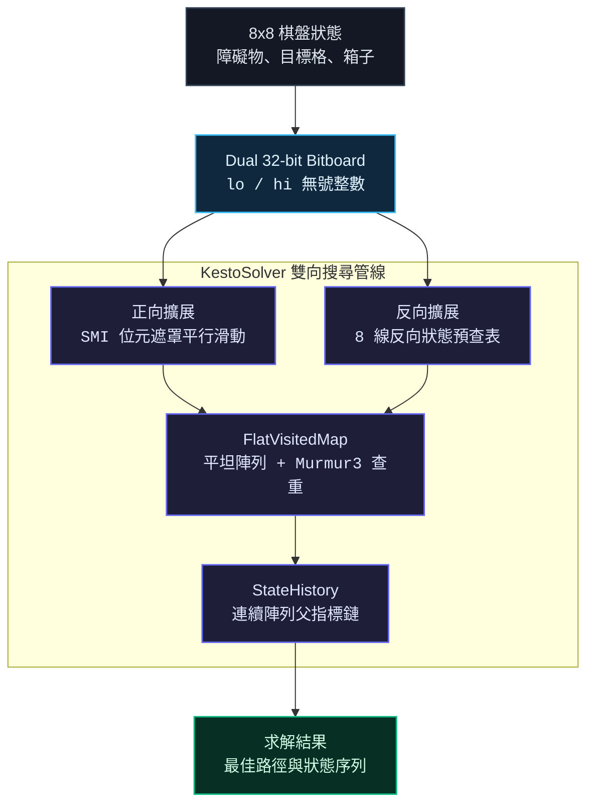

## 背景與核心挑戰

Kesto 是一款源自 [Kesto Puzzle](https://kestopuzzle.com/) 的滑塊推擠謎題。在 8x8 方格棋盤中，散佈著障礙物、目標格與多顆箱子。每次向上下左右任一方向推動時，所有未受阻礙的箱子會同時直線滑動，直到撞上牆壁、邊界或前方已停下的箱子。目標是讓所有箱子同時停在目標格上。

在瀏覽器端實作求解器時，主要面臨以下技術挑戰：

1. 狀態空間爆炸：多箱子同時推擠使有效分支度提高，正向單向搜尋在步數較深時搜尋樹會迅速膨脹。
2. GC 停頓：在走訪數百萬至千萬節點的過程中，若頻繁配置物件或使用原生 Map 查重，會引發頻繁的 GC 停頓並造成畫面卡頓。
3. 反向轉移的不可逆性：滑動推擠具有多對一收斂特性，多個不同前置狀態可能在滑動後收斂為同一狀態，反向推導前置狀態極具計算成本。
4. 箱子身分與動畫連續性：狀態中僅儲存座標集合，缺乏箱子個體身分，在狀態切換時需要正確配對前後位置以呈現流暢動畫。

為了解決這些問題，本專案設計了一套以 32-bit SMI 位元運算與雙向 BFS 為核心的高效求解引擎。

---

## 系統架構

求解引擎的核心搜尋管線涵蓋位元狀態轉換、雙向狀態擴展、記憶體查重與路徑回溯：



---

## 核心技術實現

### 1. Dual 32-bit SMI Bitboard 平行推擠

將 8x8 共 64 格棋盤拆分為 lo 與 hi 兩個 32 位元無號整數，分別對應 Cell 0~31 與 Cell 32~63：

- 鎖定 V8 SMI 路徑：數值全程保持在 32 位元整數範圍，避免 BigInt 的物件包裝成本與浮點數轉換開銷。
- 位元遮罩平行推擠：利用行列遮罩與位元移位，所有箱子同步滑動，並透過動態阻擋傳遞在最多 8 次迭代內收斂。
- 零配置設計：運算結果直接寫入預先配置的 Uint32Array 緩衝區，搜尋迴圈內部維持 0 次記憶體配置。

```typescript
export function moveStepBitboardFast(
	bLo: number,
	bHi: number,
	wLo: number,
	wHi: number,
	dirCode: number,
	out: Uint32Array
): boolean {
	let mLo = bLo >>> 0;
	let mHi = bHi >>> 0;

	for (let iter = 0; iter < 8; ++iter) {
		const statLo = (bLo ^ mLo) >>> 0;
		const statHi = (bHi ^ mHi) >>> 0;
		const blockDestLo = (destLo & (wLo | statLo)) >>> 0;
		const blockDestHi = (destHi & (wHi | statHi)) >>> 0;
		if (blockedSrcLo === 0 && blockedSrcHi === 0) break;
		mLo = (mLo ^ blockedSrcLo) >>> 0;
		mHi = (mHi ^ blockedSrcHi) >>> 0;
	}
	out[0] = ((bLo ^ mLo) | finalDestLo) >>> 0;
	out[1] = ((bHi ^ mHi) | finalDestHi) >>> 0;
	return out[0] !== bLo || out[1] !== bHi;
}
```

---

### 2. 雙向 BFS 與 8 線反向預查表

正向搜尋在解題深度較大時擴展量極高。本引擎採用雙向 BFS，正向與反向交替擴展，將搜尋複雜度由 $O(b^d)$ 降至 $O(b^{d/2})$。

反向搜尋的核心難題在於滑動的不可逆性。本引擎將棋盤拆分為 8 行與 8 列獨立處理：

- 單線預查表：預先計算 256 x 256 陣列，以障礙物與結果位元為鍵，直接查出該 8-bit 線路上所有可能的前置位元分佈。
- 展平組合器：建立連續遮罩陣列，在反向展開時透過展開迴圈組合各線的前置狀態，以微秒級速度枚舉合法前置狀態。

---

### 3. 連續記憶體 TypedArray 與零 GC 架構

為了避免 GC 造成的微卡頓，核心資料結構皆採用緊湊的連續記憶體配置：

- FlatVisitedMap：以開放定址法與線性探測實作自訂雜湊表，底層由 keysLo、keysHi 與 valuesG 組成，配合 Murmur3 雜湊，平均探測次數小於 1.3。
- StateHistory：使用連續陣列管理父節點指標，路徑回溯僅需根據整數索引追蹤，無需建立任何物件節點。

---

### 4. 匈牙利演算法與 FLIP 動畫

狀態切換時，箱子在資料結構中僅以排序後的位元位置表示，沒有固定身分。如果隨機配對前後座標，動畫會出現交叉穿透的視覺錯誤。

- 最小位移配對：在 UI 層實作匈牙利演算法，以箱子移動距離的平方和建立成本矩陣，求解總位移最小的最佳一對一配對。
- FLIP 動畫：取得配對後，透過 FLIP 技巧讀取初始位置並套用 Transform 偏移，在渲染幀切換為硬體加速過渡動畫。

---

### 5. 非同步時間切片調度

求解過程中每擴展 8,192 個節點檢查執行時間。若單次執行超過閾值，主動讓出主執行緒並觸發進度回呼，確保在密集運算時瀏覽器仍能保持流暢渲染並能即時響應取消操作。

---

## 基準測試與效能驗證

在 Node.js 與 V8 環境下執行基準測試套件，9 大典型關卡的實測結果如下：

| 關卡名稱   | 箱子與牆壁  | 最佳解步數 | 擴展節點數 | 造訪狀態數 | 搜尋耗時 | 吞吐量 ops/sec |
| :--------- | :---------: | :--------: | :--------: | :--------: | :------: | :------------: |
| Level 1    | 4 箱 / 0 牆 |    6 步    |     99     |     47     | 0.27 ms  |    ~361,500    |
| Level 2    | 4 箱 / 8 牆 |   12 步    |   2,914    |   1,745    | 2.58 ms  |   1,126,488    |
| Level 3    | 6 箱 / 4 牆 |   12 步    |   10,979   |   7,515    | 2.09 ms  |   5,241,824    |
| Level 4    | 6 箱 / 8 牆 |    7 步    |    491     |    423     | 0.11 ms  |   4,471,767    |
| Level 5    | 8 箱 / 4 牆 |   12 步    |   29,768   |   20,704   | 7.17 ms  |   4,151,338    |
| Level 6    | 8 箱 / 4 牆 |   16 步    |  101,722   |   74,443   | 13.86 ms |   7,339,197    |
| Level 7    | 4 箱 / 5 牆 |   18 步    |   12,038   |   6,081    | 2.74 ms  |   4,381,597    |
| Level 8    | 2 箱 / 2 牆 |   14 步    |   1,904    |    760     | 0.28 ms  |   6,737,438    |
| Level 9    | 8 箱 / 2 牆 |   15 步    |   22,368   |   15,954   | 4.80 ms  |   4,658,350    |
| 總計與平均 |      —      |     —      |  182,283   |     —      | 33.9 ms  |   5,372,737    |

### 16 箱極限壓力測試

針對 16 顆箱子同時推擠的高難度關卡進行壓力測試：

- 探索節點數：12,416,050 節點，造訪 10,820,630 個獨立狀態
- 求解耗時：5.29 秒
- V8 堆記憶體淨增長：7.81 MB，總 Heap 佔用 15.92 MB
- 結論：連續 TypedArray 架構在千萬級節點擴展下，能夠維持零 GC 抖動與穩定的記憶體佔用。

---

## 專案功能與開源發布

- 原作謎題：[Kesto Puzzle 官方網站](https://kestopuzzle.com/)
- 線上展示：[GitHub Pages 網頁版](https://wangicheng.github.io/kesto-engine/)，支援關卡畫布繪製、筆刷快捷鍵、JSON 匯入匯出與逐步回放。
- 開源原始碼：[GitHub Repository](https://github.com/wangicheng/kesto-engine)，採用 MIT 授權，包含 TypeScript 求解器與基準測試套件。
