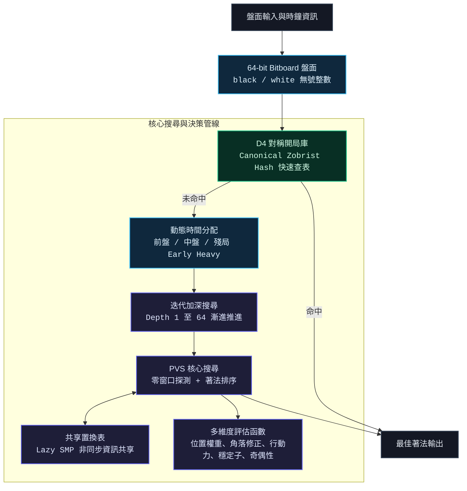

## 背景與賽制規則

本專案源自人工智慧課程的黑白棋錦標賽。賽制採用 5 輪瑞士制循環賽，每場對戰包含先後手各執一局，單局雙方各有 5 分鐘思考時間限制。勝負判定優先依照勝局數，若平手則依序比較勝局總吃子數（超時勝以 0 子計）、作業測試勝率與繳交順序。

在嚴格的時間與記憶體限制下，基準程式面臨以下瓶頸：

1. 評估維度單一：僅以當前子數差作為評估指標，容易落入貪吃陷阱並喪失行動空間。
2. 搜尋效率低落：二維陣列與標準 Alpha-Beta 剪枝無法有效利用 CPU 快取，單核固定深度搜尋難以突破 6 到 8 層。
3. 重複狀態計算：缺乏局面快取機制，殊途同歸的盤面被反覆計算，浪費寶貴的時鐘週期。
4. 開局盲目與殘局失控：缺乏理論開局庫引導，且殘局階段無法及時切換為精確終局求解。

為了解決這些問題，我帶領團隊自底向上重構引擎架構，透過位元平行運算、進階搜尋演算法、對稱開局庫與平行運算，將整體棋力提升至全新層次。

---

## 系統架構

整體引擎涵蓋底層資料表示、啟發式評估、搜尋推進與先驗知識庫：



---

## 核心技術實現

### 1. 64-bit Bitboard 與 8 方向平行位移

將 8x8 棋盤表示為兩個 64 位元整數，分別代表黑棋與白棋位置。透過預先計算的 8 方向位移量與邊界遮罩，可在不使用逐格迴圈與分支判斷的情況下，以純位元邏輯平行計算全盤合法步與翻轉棋子：

```c
static const int DIR_SHIFTS[8] = {1, -1, 8, -8, 9, 7, -7, -9};
static const uint64_t DIR_MASKS[8] = {
    0x7f7f7f7f7f7f7f7fULL, 0xfefefefefefefefeULL, ~0ULL, ~0ULL,
    0x7f7f7f7f7f7f7f7fULL, 0xfefefefefefefefeULL, 0x7f7f7f7f7f7f7f7fULL, 0xfefefefefefefefeULL
};

uint64_t Engine_GetLegalMoves(Board b, int color) {
    uint64_t me = (color == BLACK) ? b.black : b.white;
    uint64_t opp = (color == BLACK) ? b.white : b.black;
    uint64_t empty = ~(me | opp);
    uint64_t moves = 0ULL;

    for (int d = 0; d < 8; ++d) {
        uint64_t cur = shift_dir(me, DIR_SHIFTS[d], DIR_MASKS[d]) & opp;
        while (cur) {
            uint64_t next = shift_dir(cur, DIR_SHIFTS[d], DIR_MASKS[d]);
            moves |= next & empty;
            cur = next & opp;
        }
    }
    return moves;
}
```

配合硬體指令如 popcount 與 ctz，引擎得以達到極高的節點走訪吞吐量。

---

### 2. PVS 搜尋與迭代加深架構

傳統 Alpha-Beta 搜尋對所有子節點皆使用全窗口進行檢索。本引擎採用 PVS 演算法，假設首個搜尋的走法極大概率為最佳解：

- 首步全窗口搜尋：對排序後的第一個子節點進行完整範圍搜尋。
- 零窗口探測：對後續所有走法使用極小窗口（[-alpha-1, -alpha]）進行探測，若未能引發剪枝且分數優於預期，才重新以完整窗口重搜。
- 迭代加深推進：由淺層逐層加深，確保在任何時間中斷點皆有完整的上一層搜尋結果可用，同時將淺層結果作為深層搜尋的排序基準。

```c
for (int i = 0; i < local_count; i++) {
    int idx = local_moves[i];
    Board next_b = Engine_MakeMove(b, idx, color);
    int score;

    if (moves_searched == 0) {
        score = -PVS(next_b, 1 - color, depth - 1, -beta, -alpha, false, ctx);
    } else {
        score = -PVS(next_b, 1 - color, depth - 1, -alpha - 1, -alpha, false, ctx);
        if (score > alpha && score < beta && !ctx->stop) {
            score = -PVS(next_b, 1 - color, depth - 1, -beta, -alpha, false, ctx);
        }
    }

    if (ctx->stop) return 0;
    moves_searched++;

    if (score > best_score) best_score = score;
    if (score > alpha) {
        alpha = score;
        type = HASH_EXACT;
    }
    if (alpha >= beta) {
        type = HASH_BETA;
        break;
    }
}
```

---

### 3. Zobrist 雜湊與共享置換表

為避免重複盤面的冗餘展開，引擎以 64 位元 Zobrist 雜湊為每個盤面建立唯一鍵值，並維護容量達數百萬條目的置換表：

- 條目結構緊湊化：每個節點記錄雜湊值、搜尋深度、分數以及邊界類型（精確值、下界、上界）。
- 無鎖讀寫設計：置換表在多執行緒環境下允許良性資料競爭，透過深度優先與永遠替換策略維持最新且高品質的盤面資訊。

---

### 4. 領域啟發式評估函數

評估函數脫離了單純計算子數的初階邏輯，結合了多項關鍵領域特徵：

- 靜態位置權重與動態角落修正：為角位賦予極高權重（+120），危險的 X 位與 C 位預設給予負分懲罰。當角落被佔據後，動態取消鄰近格子的負分懲罰。
- 行動力：計算雙方合法步數差，在開局與中盤維持對手的行動限制。
- 前線子：計算鄰近空格的棋子數量差，對裸露的前線子給予負分，促使引擎往內部紮根。
- 邊緣穩定子：從四個角沿邊緣檢查不可翻轉的絕對穩定棋子，給予高達 +150 的加權。
- 奇偶性分析：在空位少於 16 格時切換殘局模式，計算空格奇偶性並追求取得最後一手落子權。

---

### 5. D4 群 8 向對稱正規化開局庫

黑白棋具備旋轉與鏡像共 8 種空間對稱性。傳統開局庫會將對稱盤面視為不同狀態分別儲存，造成嚴重的空間浪費與數據稀釋。

本專案實作盤面標準化演算法，將任何盤面旋轉翻轉至字典序最小的標準型態：

```c
uint64_t Book_Canonicalize(Board b, int turn, int* out_sym_id, uint8_t* out_sym_mask) {
    Board variants[8];
    for (int i = 0; i < 8; i++) {
        variants[i].black = ApplySymmetry(b.black, i);
        variants[i].white = ApplySymmetry(b.white, i);
    }

    int best_id = 0;
    uint8_t mask = 1;

    for (int i = 1; i < 8; i++) {
        if (variants[i].black < variants[best_id].black ||
           (variants[i].black == variants[best_id].black && variants[i].white < variants[best_id].white)) {
            best_id = i;
            mask = (1 << i);
        } else if (variants[i].black == variants[best_id].black && variants[i].white == variants[best_id].white) {
            mask |= (1 << i);
        }
    }

    if (out_sym_id) *out_sym_id = best_id;
    if (out_sym_mask) *out_sym_mask = mask;
    return ComputeHashInternal(variants[best_id], turn);
}
```

透過對稱轉換，開局庫有效容量直接提升 8 倍，同時等效走法透過 O(1) 雙向查表完成轉換。配合獨立開發的離線 BFS 平行訓練程式，自動生成涵蓋十數層深度的開局資料庫。

---

### 6. Lazy SMP 多執行緒並行與後台思考

為充分釋放多核心處理器效能，引擎採用 Lazy SMP 平行架構：

- 根節點位移遍歷：各 OpenMP 執行緒在迭代加深主迴圈中，以不同的循環位移走訪根節點走法。
- 共享置換表協同：各執行緒在走訪深層分支時不斷填充與讀取共享置換表，自然形成非同步的資訊共享與搜尋加速。
- 後台思考機制：在對手思考期間啟動獨立執行緒對當前盤面預先搜尋，使對手落子後我方能以極短延遲回傳高品質著法。

---

## 實測表現與對戰分析

### 1. 基準程式對戰測試

在標準測試環境下，與課程基準程式進行 20 局先後手交替對抗測試：

| 評測項目     | 舊版基準程式            | 本專案新版引擎                           |
| :----------- | :---------------------- | :--------------------------------------- |
| 盤面資料結構 | 二維陣列與巢狀迴圈      | 64-bit Bitboard 與位元平行運算           |
| 搜尋核心     | 單執行緒標準 Alpha-Beta | Lazy SMP 多執行緒 PVS + 迭代加深         |
| 平均搜尋深度 | 6 ~ 8 層                | 20 層以上（殘局精確解算到底）            |
| 開局策略     | 隨機落子                | D4 對稱正規化開局庫秒下最佳手            |
| 評估維度     | 貪心吃子差              | 位置權重、行動力、穩定子、前線子、奇偶性 |
| 對抗基準勝率 | 24.4%                   | 100%（20 戰全勝）                        |

### 2. 錦標賽正式實測

在 5 輪瑞士制錦標賽中，本引擎以全勝戰績（5 戰全勝，每場兩局交換先後手）順利奪得第一名。

---

## 總結

本專案將理論演算法與底層系統工程緊密結合，透過 Bitboard 奠定每秒數百萬節點的算力基礎，結合 PVS 剪枝與 Lazy SMP 平行加速大幅拓展思考深度，並以多維度啟發評估與對稱開局庫建立穩固的盤面掌控力，最終在 5 輪瑞士制錦標賽中以 5 場全勝戰績奪得冠軍。
