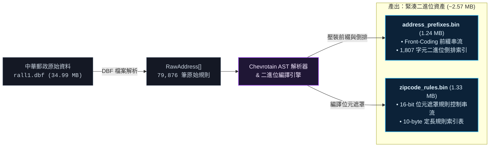
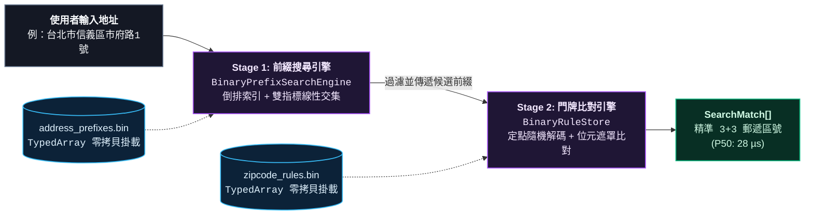

## 背景

我在開發需要頻繁查詢台灣地址的系統時，發現要精準將地址對應至 3+3 碼郵遞區號並不容易。全台涵蓋 79,876 筆門牌對照規則與 44,658 條路名門牌前綴，包含單雙號、跨號起訖、附號（例如 1之23號）、地下室與樓層等複雜中文條件。

既有方案在現代前端與邊緣運算環境中面臨明顯瓶頸：

| 方案             | 運作機制                      | 體積與延遲           | 主要限制                            |
| ---------------- | ----------------------------- | -------------------- | ----------------------------------- |
| 官方線上查詢     | 透過 POST 發送請求並解析 HTML | 延遲約 250 ms        | 無法離線使用，難以批次處理          |
| 官方原始 DBF     | 載入 35 MB 的原始資料檔       | 體積過大             | 缺乏前綴壓縮與索引，載入負擔重      |
| 記憶體 JSON 展開 | 將規則轉為 JSON 載入 V8 物件  | 堆記憶體淨增 35.7 MB | 產生數十萬個物件，冷啟動耗時 246 ms |

既有方案要不是依賴外部網路，就是需要龐大的記憶體開銷。我決定自底向上設計一套全二進位零展開的解析引擎，在保持完全離線與微秒級檢索的前提下，將資產體積與冷啟動時間壓縮至極限。

## 系統架構與編譯流程

為了將查詢開銷降至最低，我將運算重心轉移至建置期。整體架構分為「**離線建置與二進位編譯**」與「**執行期雙階段查詢**」兩大流程：

### 1. 離線建置與二進位編譯流程

在編譯階段，系統解析官方 35 MB 原始資料，並透過 AST 編譯器將非結構化中文規則壓裝為兩份緊湊的二進位資產：

_圖 1：離線二進位編譯與資產壓裝流程圖_

### 2. 執行期雙階段查詢流程

在執行期，查詢引擎直接透過 `TypedArray` 零拷貝掛載二進位資產，透過雙階段過濾在微秒級內精準鎖定 3+3 郵遞區號：

_圖 2：執行期雙階段查詢流程圖_

## 核心演算法與設計

### 區塊化增量前綴編碼

全台 44,658 條前綴字串存在極高重疊性。我採用 Block-Based Front Coding，將排序後的前綴以每 $K=64$ 條切為一個獨立區塊：

- 區塊首筆作為錨點，記錄完整字串長度與位元組。
- 後續 63 筆僅記錄與前一筆的共同前綴長度、剩餘長度及差異字元。
- 透過定長區塊索引表直接計算目標位置：
  $$\text{blockIdx} = \lfloor \text{targetId} / 64 \rfloor, \quad \text{offsetInBlock} = \text{targetId} \pmod{64}$$

查詢時僅需針對目標候選 ID 進行定點解碼（單次耗時約 $7.5\ \mu\text{s}$），其餘資料全程維持在 Uint8Array 原始位元組狀態，完全不需要在初始化時解碼整個字串庫。

### 二進位倒排索引與雙指標線性交集

為了從輸入地址快速鎖定對應前綴，我構建了二進位倒排索引：

- 倒排字元表收錄 1,807 個獨立字元，每個字元以 10 位元組（charCode, offset, len）記錄在二進位檔中，並依編碼排序以支援 $O(\log C)$ 二分搜尋。
- 地址中每個字元對應一個已排序的 ID 陣列。查詢時直接在原生 TypedArray 上以雙指標進行線性掃描交集，不建立 Set 或 Map 等中介物件，在數微秒內將全台 4.4 萬條前綴迅速收斂至匹配的候選清單。

### 門牌條件 AST 編譯與位元遮罩比對

中文門牌規則包含如「雙720號至1092巷」、「連151號至151之3號3樓以上」、「7號地下3樓至1樓」等非結構化敘述。

我在編譯期使用 Chevrotain 建立語法解析器，將非結構化文字編譯為語意 AST，並轉化為 16-bit 位元遮罩與數值範圍串流。執行期比對時，查詢引擎直接讀取緩衝區數值進行位元遮罩運算，判定單雙號、起訖範圍、附號與樓層條件，比對過程零物件宣告、零字串切割。

### 規則二進位雙向無損轉換

全台近 8 萬筆門牌規則若在二進位檔案中同時保留原始文字描述，會帶來龐大的字串冗餘開銷。

我將二進位規則格式設計為具備完全雙向無損轉換能力的緊湊結構。位元遮罩與數值欄位在壓裝條件的同時，完整保留了語法樹的所有語意細節。因此二進位資產內完全不儲存任何原始規則字串；當外部介面或除錯流程需要取得規則敘述時，引擎直接由二進位資料即時逆向重建出原始中文規則字串，在兼顧除錯需求與功能完整性的同時大幅降低二進位資產體積。

## 實測與效能評測

在 V8 執行環境下對比各方案的效能表現：

| 評估項目          | 官方線上查詢       | 官方原始 DBF | 記憶體 JSON 展開          | ZipCodeTw 全二進位零展開         |
| ----------------- | ------------------ | ------------ | ------------------------- | -------------------------------- |
| 運作環境          | 需外部連網         | 本地環境     | Node / 瀏覽器（載入沉重） | Node / 邊緣運算 / 瀏覽器         |
| 初始資產體積      | 無本地資產         | 34.99 MB     | 11.93 MB                  | 783 KB (Brotli) / 2.57 MB (.bin) |
| 引擎冷啟動耗時    | N/A                | 未實測       | 246.45 ms                 | 12.11 ms                         |
| V8 堆記憶體淨增長 | 0 MB               | N/A          | 35.74 MB                  | 0.00 MB                          |
| 單次查詢延遲      | 253.77 ms (含網路) | 未實測       | 0.0472 ms                 | 0.0358 ms (P50: 28.0 µs)         |
| 查詢吞吐量        | ~4 QPS             | 未實測       | ~21,200 QPS               | ~27,900 QPS                      |

### 不同查詢負載實測

針對 5 種真實門牌複雜度各執行 5,000 次查詢統計：

| 門牌負載類型     | 平均延遲 | 中位數 P50 | P95 延遲  | 演算法行為說明                 |
| ---------------- | -------- | ---------- | --------- | ------------------------------ |
| 精確單點門牌     | 31.90 µs | 21.90 µs   | 59.60 µs  | 單點命中，位元遮罩快速通過驗證 |
| 單雙號區間門牌   | 29.94 µs | 23.10 µs   | 61.10 µs  | 介於起訖區間比較與單雙號驗證   |
| 巷弄與附號門牌   | 56.82 µs | 45.50 µs   | 95.70 µs  | 多重附號與子號條件逐項比對     |
| 樓層與地下室條件 | 93.94 µs | 96.30 µs   | 139.10 µs | 樓層位元遮罩與地下層範圍驗證   |
| 查無結果負向查詢 | 12.49 µs | 8.50 µs    | 37.10 µs  | 倒排指標交集為空，提前中斷     |

## 產業交流與反思

完成演算法設計與引擎實作後，我曾與中華郵政資訊處郵務資訊科進行技術交流。官方回覆表示已將此二進位架構轉交協力開發廠商，作為未來系統架構的評估參考。

這個專案讓我體會到，在資源受限的 Web 前端或邊緣運算環境中處理龐大資料集時，不一定要妥協於傳統的 JSON 物件反序列化模式。透過在建置期把非結構化文字編譯為緊湊的二進位佈局，配合定點隨機解碼與位元遮罩比對，就能以不到 1 MB 的資產體積實現微秒級的純離線檢索。
